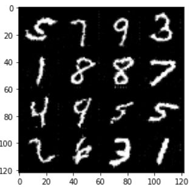

# GAN_To_Generate_Digit_Image
Deep learning with Pytorch

GANs have really interesting way of generating realistic fake images. They use two models
named as generator and discriminator. In DCGANs, these models are implemented using CNNs(Convolutional Neural Networks).

Generator learns to create images that look real, while a discriminator  learns to tell real images apart from fakes.

Each epoch, the generator improves at creating images that look real, while the discriminator improves at distinguishing them apart.
DCGAN becomes fully trained when the discriminator can no longer distinguish real images from fakes, which is tracked using concept of real and fake loss.

  
source:[tensorflow.org](https://www.tensorflow.org/tutorials/generative/dcgan)

Image generated after 25 epochs:  

